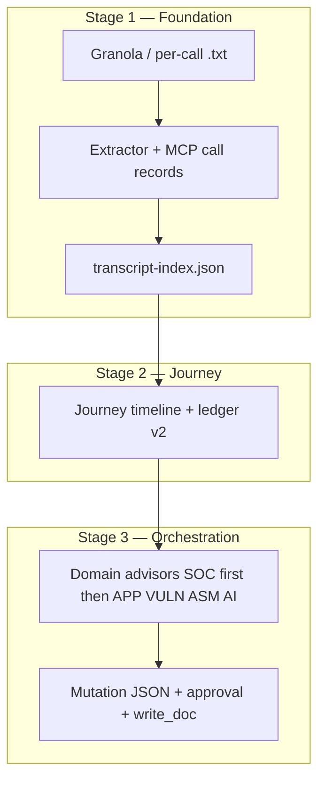

# PrestoNotes v2 — MVP Build Plan (Follow-Along)

This document is the **operational guide** for migrating and rebuilding from `../prestoNotes.orig` into this repo. It combines:

- **[`examples/BUILD_ADVISORY.md`](../examples/BUILD_ADVISORY.md)** — vertical slices, task order, session habits _(if `examples/` is gitignored locally, open the file from your working tree or history)_  
- **[`docs/project_spec.md`](project_spec.md)** — full architecture, §9 task definitions, §11 MVP triggers  
- **[`.cursor/rules/workflow.mdc`](../.cursor/rules/workflow.mdc)** — main Agent as planner/orchestrator; phase flow, approval gates, delegation to `/coder`, `/tester`, `/doc`  

**Rule of thumb:** Do **not** skip ahead of §9 ordering. Do **not** start Stage 2 work until **TASK-009** (Stage 1 validation) is done — see **Part 5** in [`examples/BUILD_ADVISORY.md`](../examples/BUILD_ADVISORY.md).

### 0. v2 naming: `prestonotes_gdoc/` (not `custom-notes-agent/`)

v1 kept Google Docs Python under **`custom-notes-agent/`**, which sounds like a Cursor agent but is really **REST + mutation plumbing**. v2 renames that tree to **`prestonotes_gdoc/`** so it sits beside **`prestonotes_mcp/`** as clear **execution** code. **Sub-agents** (extractor, domain advisors, orchestrator) stay in **`.cursor/rules/`** and **`docs/ai/playbooks/`**.

- **Copy from:** `../prestoNotes.orig/custom-notes-agent/`  
- **Copy into:** `prestonotes_gdoc/` (same internal layout at first port: `config/`, scripts, optional `sections/`).  
- **MCP + yaml defaults** must use `prestonotes_gdoc/...` paths (see [`project_spec.md` §4](project_spec.md#4-directory-structure)).

---

## 1. What “MVP” means here

| Layer | Meaning |
|--------|--------|
| **Product MVP (§11)** | All **MVP triggers** in [`project_spec.md` §11](project_spec.md#11-trigger-phrase-reference-mvp) — through **TASK-019** (orchestrator, advisors, debug playbook). **Stage 4 (RAG)** is **not** MVP; it is **TASK-020–022** when you have API keys. |
| **First vertical slice (Stage 1 “done”)** | Transcript → **structured call record** → **MCP persists JSON** → AI reads **index + records** instead of 50KB masters. Proven on a **real customer** in **TASK-009**. |

If you only complete Stage 1, you already have a valuable subsystem; Stages 2–3 add journey narrative and the full **Update Customer Notes** orchestration.

---

## 2. What you are building (mental model)



- **Python + MCP** execute writes and Google APIs; the **LLM proposes** mutation JSON after reading context ([`project_spec.md` §2](project_spec.md)).  
- **`run_pipeline` is not ported** — orchestration is Cursor rules + `write_doc`, not `run-main-task.py`.

---

## 3. Planner workflow (every task)

Per **workflow.mdc** (orchestrator):

| Phase | Who | What |
|-------|-----|------|
| **1 — Spec/Plan** | Planner | Read `project_spec.md` §9 for this task; read [`MIGRATION_GUIDE.md`](MIGRATION_GUIDE.md) if porting; create **`docs/tasks/active/<slug>.md`**; get your **approval** before code. |
| **2 — Code** | `/coder` subagent | Implements from the task file + spec (TDD where specified). |
| **3 — Verify** | `/tester` subagent | `pytest`, `ruff`, hooks per §10. |
| **4 — Doc** | `/doc` subagent | README / docs match what shipped. |
| **5 — Ready** | Planner | Archive task file to `docs/tasks/archive/YYYY-MM/`; update [`docs/tasks/INDEX.md`](tasks/INDEX.md). |

**Escalation:** If verify fails 3 times, stop and ask you for manual intervention (workflow.mdc).

---

## 4. Session habits (avoid losing the thread)

1. **One active task file** in `docs/tasks/active/` — top of file: **Next action** (update after each step).  
2. **Start sessions** with:

   ```text
   Read `docs/tasks/INDEX.md` as the orchestrator and report: (1) active task (2) phase (3) next action
   ```

3. **Prefer one TASK per Cursor session** for migration work (BUILD_ADVISORY Part 3).  
4. **`docs/tasks/INDEX.md`** is the backlog board: Current active → Backlog → Completed.

---

## 5. Task file template (planner creates this per task)

Each active task should include:

```markdown
# TASK-XXX — <short title>

## Status
Phase: Spec | Code | Verify | Doc | Done

## Legacy Reference (if porting)
- Source: `../prestoNotes.orig/...`
- Strip: hardcoded paths | prompts | none
- Keep: <one line>

## Goal
<copy/adapt from project_spec §9>

## Acceptance / Tests
<copy Test section from §9>

## Next action
<single line — updated every step>
```

---

## 6. MVP task sequence — what gets built, how you validate

Below: **TASK** → **what you’re building** → **you know it’s done when…** (see §9 for full detail).

### Stage 1 — Transcript → call records (TASK-001–009)

| Task | What you’re building | Validate |
|------|----------------------|----------|
| **001** | Repo layout: `prestonotes_mcp/`, **`prestonotes_gdoc/`** placeholder (README), `docs/MIGRATION_GUIDE.md`, CI-ish scripts, `pyproject` 2.x | `python -c "import prestonotes_mcp"`; `scripts/ci/check-repo-integrity.sh` passes |
| **002** | MCP **read** tools + resources (`discover_doc`, `read_doc`, …); **no** `run_pipeline` | Server starts; pytest read-tools; needs **`prestonotes_gdoc/`** populated or merge TASK-002+003 |
| **003** | MCP **write/sync** + port v1 GDoc stack **into `prestonotes_gdoc/`** for `write_doc`, `append_ledger`, bootstrap | pytest write tools; `dry_run` only in CI for destructive ops |
| **004** | **New** tools: `write_call_record`, `read_call_records`, `update_transcript_index`, `read_transcript_index` | pytest round-trip record + index |
| **005** | `granola-sync.py` + per-call `Transcripts/*.txt` story | pytest idempotency + routing; doc split path in MIGRATION_GUIDE if needed |
| **006** | rsync / Drive / markdown export scripts | `rsync-gdrive-notes.sh --dry-run` works |
| **007** | Core `.mdc` rules + **MVP playbooks:** `load-customer-context` + **`update-customer-notes`** + **`run-license-evidence-check`**; **not** BVA / logic-audit (deferred) | Manual: Load Customer Context + **Update Customer Notes** (plan/approval gate) + **Run License Evidence Check** on **`TestCo`** (or document wiz/cache blockers) |
| **008** | `21-extractor.mdc` + **Extract Call Records** playbook | Manual: structured JSON + MCP writes for a real-ish transcript |
| **009** | Runbook **test-call-record-extraction**; real customer dry run | **Gate:** accuracy + coverage report — **do not start Stage 2 until this passes** |

### Stage 2 — Journey (TASK-010–014)

| Task | What you’re building | Validate |
|------|----------------------|----------|
| **010** | `write_journey_timeline`, `update_challenge_state` | pytest |
| **011** | `append_ledger_v2` + migration helper | pytest + fixture ledger |
| **012** | `22-journey-synthesizer` + **Run Journey Timeline** | Manual on 5+ call customer |
| **013** | Exec summary template + **Run Account Summary** | Manual VP-readable output |
| **014** | **Run Challenge Review** playbook | Manual challenge table |

### Stage 3 — Advisors + orchestration (TASK-015–019)

| Task | What you’re building | Validate |
|------|----------------------|----------|
| **015** | **SOC** advisor `.mdc` (wiz-local search) | Manual JSON recommendations |
| **016** | **APP, VULN, ASM, AI** advisors | Manual; ASM uses diagrams if present |
| **017** | **20-orchestrator** + task router; **Update Customer Notes** | Manual full pipeline + approval gate |
| **018** | **Run Exec Briefing** | One page, no jargon |
| **019** | **debug-pipeline** + Stage 3 signoff vs v1 quality | Manual comparison + logic audit |

### Stage 4 — After MVP (optional)

| Task | What | When |
|------|------|------|
| **020–022** | Chroma + `wiz_knowledge_search` + advisor swap | When embedding/API keys exist ([§9](project_spec.md#stage-4--rag-and-automation-requires-api-keys--build-when-ready)) |

---

## 7. Hard gates (do not skip)

1. **TASK-009** complete before **TASK-010**.  
2. **`prestonotes_gdoc/`** + **TASK-003** before trusting **write_doc** in production paths.  
3. **User approval** before any mutating MCP tool ([`project_spec.md` §2–3](project_spec.md)).  
4. **TASK-011** before orchestrator uses **`append_ledger_v2`** in anger (§2 ledger subsection).

---

## 8. Where to look in the old repo

| Need | See |
|------|-----|
| MCP server shape | `../prestoNotes.orig/prestonotes_mcp/server.py` |
| GDoc Python backend (port target **`prestonotes_gdoc/`**) | `../prestoNotes.orig/custom-notes-agent/` |
| Granola | `../prestoNotes.orig/scripts/granola-sync.py` |
| Full port table | [`project_spec.md` §8](project_spec.md#8-legacy-reference-guide) |

---

## 9. Optional: migration mode rule

If you add **`.cursor/rules/99-migration-mode.mdc`**, use it only until **TASK-019** is done; then archive it (BUILD_ADVISORY Part 4). Content can match the block in [`examples/BUILD_ADVISORY.md`](../examples/BUILD_ADVISORY.md) Part 4.

---

## 10. Document map

| Doc | Role |
|-----|------|
| [`project_spec.md`](project_spec.md) | Architecture, rules, full §9 specs, §11–12 triggers |
| [`MIGRATION_GUIDE.md`](MIGRATION_GUIDE.md) | Legacy path, checklist, discrepancies, **`prestonotes_gdoc/`** file list |
| [`tasks/INDEX.md`](tasks/INDEX.md) | Active / backlog / completed tasks |
| This file | **How** to execute MVP in order with validation |

When in doubt: **§9 task Test section is law**; this plan is navigation.
